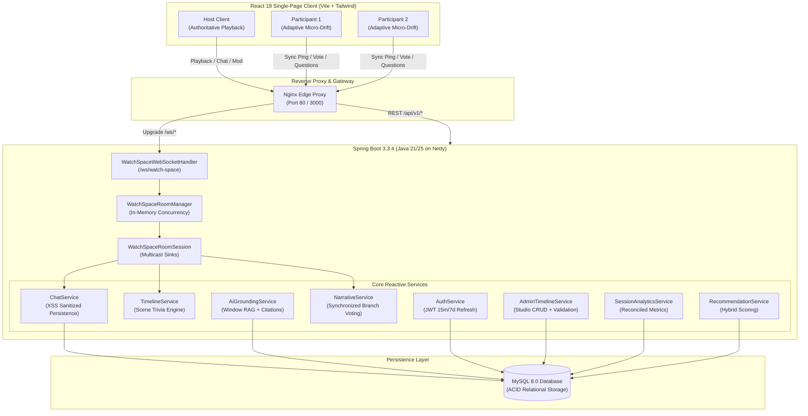

# Netflix AI Watch Spaces 🎬🤖

> **Full-Stack AI-Powered Real-Time Social Watch Platform**  
> *Authoritative Sub-250ms Synchronized Streaming • Grounded AI Co-Pilot • Synchronized Scene Trivia • Interactive Narrative Variation Voting • Admin Timeline Studio*

---

> [!IMPORTANT]
> **Legal Disclaimer**: This project is **NOT** an official Netflix integration. It does not use Netflix private APIs, Netflix accounts, private infrastructure, or copyrighted Netflix assets. All streaming media relies strictly on open-source, Creative Commons-licensed films (*Tears of Steel*, *Sintel*, *Big Buck Bunny* by the Blender Foundation).

---

## 1. System Architecture & High-Level Design

Netflix AI Watch Spaces is architected as an event-driven, reactive real-time platform combining **Spring WebFlux Reactive WebSockets** for low-latency multicast distribution and a **Cinematic Obsidian React** single-page application.



---

## 2. Technology Stack

### Frontend
- **Framework**: React 18 + Vite
- **Routing**: React Router DOM v6
- **Styling**: Tailwind CSS ("Cinematic Obsidian" glassmorphic dark palette `#07090e`, glowing borders, soft shadows)
- **Icons**: Lucide React
- **Video Engine**: HTML5 Custom Video Player with micro-drift adaptive playback and native WebVTT subtitle track switching
- **State & Context**: Reactive Context API (`AuthContext`, `ToastContext`), reactive event streams

### Backend
- **Runtime**: Java 21 / 25
- **Framework**: Spring Boot 3.3.4 with **Spring WebFlux** (Reactor Netty)
- **Real-Time Engine**: Reactive WebSocket with non-blocking multicast Sinks (`Sinks.Many<String>`)
- **Security**: Spring Security Reactive, HMAC-SHA256 JWT (15-minute access token, 7-day cryptographically rotated refresh tokens)
- **Data Access**: Spring Data JPA & Hibernate with HikariCP (optimized bounded elastic schedulers)
- **Validation**: Jakarta Bean Validation (`@Valid`, `@Size`, `@NotNull`, `@Pattern`), XSS & Prompt Injection Sanitizer
- **Testing**: JUnit 5, Mockito, Spring Boot Test, Reactor StepVerifier (56 automated tests)

### Database
- **Engine**: MySQL 8.0 / 9.0
- **Storage Strategy**: Relational persistence with foreign key constraints, indexes on query hot-paths (`(watch_space_id, created_at)`), and transactional atomicity.

---

## 3. Real-Time Synchronization Protocol

### 3-Tier Adaptive Micro-Drift Engine
Rather than disorienting participants with abrupt seeking and audio stutter, the platform applies a mathematical 3-tier correction model:

| Drift Tier | Drift Delta ($\Delta$) | Action Taken | User Experience |
|---|---|---|---|
| **Tier 1: In-Sync** | $\Delta < 50\text{ ms}$ | `playbackRate = 1.0x` | Seamless playback; zero rate disturbance |
| **Tier 2: Micro-Adjust** | $50\text{ ms} \le \Delta \le 250\text{ ms}$ | If lagging: `playbackRate = 1.08x`<br/>If leading: `playbackRate = 0.92x` | Imperceptible acoustic pitch catch-up (converges in $< 2\text{ s}$) |
| **Tier 3: Hard Seek** | $\Delta > 250\text{ ms}$ | Hard seek directly to `hostPosition + latencyOffset` | Instant recovery during severe packet loss or initial room join |

### WebSocket Event Protocol (`/ws/watch-space`)

Every WebSocket frame is serialized inside a strict JSON envelope:

```json
{
  "event": "room.playback.update",
  "watchSpaceId": "ws_101",
  "payload": {
    "state": "PLAYING",
    "position": 142.5,
    "playbackRate": 1.0,
    "serverTs": 1690000000123
  },
  "ts": 1690000000123
}
```

#### Core Event Catalog

| Event Name | Direction | Payload Description |
|---|---|---|
| `room.playback.update` | Host $\to$ Server $\to$ Room | Authoritative state (`PLAYING`, `PAUSED`), current position, playback rate |
| `room.presence.update` | Server $\to$ Room | Active roster with online statuses, display names, avatars, host badges, muted states |
| `room.chat.message` | Client $\leftrightarrow$ Server | Real-time chat message with XSS sanitization and MySQL persistence |
| `room.ai.trivia` | Server $\to$ Room | Deduplicated scene trivia with question, 4 choices, and 15s answer window |
| `room.variation.voteOpen` | Server $\to$ Room | Interactive storyline decision point with countdown bar |
| `room.variation.vote` | Client $\to$ Server | Participant casting vote for chosen narrative branch |
| `room.variation.applied` | Server $\to$ Room | Synchronized consensus result triggering seamless narrative branch transition |
| `room.sync.ping` | Client $\to$ Server | Heartbeat containing client timestamp for round-trip latency and clock skew estimation |
| `room.sync.pong` | Server $\to$ Client | Heartbeat response echoing timestamps for client NTP calculation |
| `room.moderation.mute` | Host $\to$ Server $\to$ Room | Mute participant chat permissions server-side |
| `room.moderation.kick` | Host $\to$ Server $\to$ Room | Forcibly evict participant from Watch Space |
| `room.moderation.lock` | Host $\to$ Server $\to$ Room | Prevent new participants from entering the room |
| `room.moderation.transferHost`| Host $\to$ Server $\to$ Room | Deterministically transfer authoritative host permissions to another participant |

---

## 4. Retrieval-Grounded AI Co-Pilot

The AI Co-Pilot architecture eliminates hallucination by strictly grounding answers in authored timeline metadata within a contextual timestamp window:

$$\mathcal{W}(t) = [t - 90\text{ seconds},\ t + 30\text{ seconds}]$$

1. **Window-Constrained Retrieval**: When a viewer asks a question (e.g., *"Why did Thom sacrifice his mechanical arm?"*), only timeline events inside $\mathcal{W}(t)$ are retrieved.
2. **Citations Contract**: Every statement emitted by the AI Co-Pilot references specific `timelineEventId` markers (e.g., `[Event #101]`).
3. **Anti-Hallucination Fallback**: If the query references characters, lore, or events not present in the catalog metadata, the engine falls back deterministically:
   > *"I cannot find verified context about that in the current scene timeline."*

---

## 5. The 10 Dedicated Cinematic Pages

1. **Landing Page (`/`)**: Cinematic hero trailer backdrop, feature highlights, live room preview, CTAs.
2. **Login Page (`/login`)**: Glassmorphic authentication card with demo quick-fill credentials.
3. **Register Page (`/register`)**: Account registration with avatar selection and password strength validation.
4. **User Dashboard (`/dashboard`)**: "Continue Watching" rail, "Live Watch Spaces" rail, "Personalized Recommendations", and quick rejoin.
5. **Watch Space (`/watch/:id`)**: Authoritative video player, sync badge, split-pane chat/roster, moderation modal, and invite share modal.
6. **AI Co-Pilot Explorer (`/ai-copilot`)**: Standalone timeline and AI intelligence explorer for catalog titles.
7. **Watch History (`/history`)**: Chronological history with completion bars and quick-host shortcuts.
8. **Recommendations (`/recommendations`)**: Deep-dive recommendation categories with match score tags.
9. **Profile & Settings (`/settings`)**: User preferences, avatar selector, default subtitle locale, AI verbosity, and sync tolerances.
10. **Admin Timeline Studio (`/admin/timeline`)**: Visual timeline event editor, marker scrubber, and bulk JSON importer/validator.

---

## 6. Getting Started & Deployment

### Prerequisites
- [Docker](https://docs.docker.com/get-docker/) & Docker Compose
- Or locally: Java 21+ JDK, Node.js 20+, and MySQL 8.0+

### Option A: One-Command Startup with Docker Compose (Recommended)

1. Clone the repository:
   ```bash
   git clone https://github.com/example/netflix-ai-watch-spaces.git
   cd netflix-ai-watch-spaces
   ```

2. Copy the environment configuration:
   ```bash
   cp .env.example .env
   ```

3. Launch the complete multi-container stack:
   ```bash
   docker compose up --build
   ```

4. Access the applications:
   - **Frontend Application**: [http://localhost:3000](http://localhost:3000)
   - **Backend REST API**: [http://localhost:8080/api/v1/health](http://localhost:8080/api/v1/health)
   - **Actuator Health Check**: [http://localhost:8080/actuator/health](http://localhost:8080/actuator/health)
   - **MySQL Database (Container)**: `localhost:3307` (Database: `netflix_watch_spaces`)

### Pre-Seeded Demo Accounts

The database is pre-seeded with sample users ready for testing:

| Role | Email | Password | Permissions |
|---|---|---|---|
| **Admin** | `admin@netflixspaces.ai` | `Admin123!` | Full Admin Studio access, timeline CRUD, bulk JSON import |
| **Host** | `host@netflixspaces.ai` | `Host123!` | Room creation, authoritative playback, moderation controls |
| **Viewer** | `viewer@netflixspaces.ai` | `Viewer123!` | Synchronized playback, chat, AI Co-Pilot, trivia, voting |

---

### Option B: Local Development Setup

#### 1. Start MySQL
Ensure MySQL 8.0 is running on port 3306. Create database `netflix_watch_spaces` and run:
```bash
mysql -u root -p netflix_watch_spaces < backend/src/main/resources/schema.sql
mysql -u root -p netflix_watch_spaces < backend/src/main/resources/data.sql
```

#### 2. Start Spring Boot Backend
```bash
cd backend
./mvnw clean spring-boot:run
```
Backend runs on [http://localhost:8080](http://localhost:8080).

#### 3. Start Vite Frontend
```bash
cd frontend
npm install
npm run dev
```
Frontend runs on [http://localhost:3000](http://localhost:3000).

---

## 7. Automated Test Suite

The test suite contains **56 automated JUnit 5 and Mockito tests** validating all core invariants:

```bash
cd backend
./mvnw test
```

### Test Coverage Highlights
- **Authentication & RBAC (`AuthServiceTest`, `AuthControllerTest`, `JwtTokenProviderTest`)**: 15-minute token expiry, token rotation, BCrypt password hashing, and role verification.
- **Authoritative Playback & Drift (`MultiClientSynchronizationTest`, `WatchSpaceRoomSessionTest`)**: Multi-client broadcast fan-out, adaptive micro-drift rate scaling, and convergence under network jitter.
- **Grounded AI Retrieval (`AiGroundingServiceTest`)**: Context window filtering `[ts - 90s, ts + 30s]`, verified `timelineEventId` citations, and anti-hallucination fallbacks.
- **Admin Timeline Studio (`AdminTimelineServiceTest`, `AdminTimelineControllerTest`)**: Marker CRUD, malformed JSON rejection with HTTP 422, timestamp bounds validation, and atomic import rollback.
- **Chat & Persistence (`ChatServiceTest`)**: XSS sanitization and MySQL persistence.
- **Session Analytics & Recommendations (`SessionAnalyticsServiceTest`, `RecommendationServiceTest`)**: Reconciled room metrics and hybrid scoring.

---

## 8. Engineering Trade-Offs & Architecture Decisions

1. **Spring WebFlux vs Standard Servlet WebSockets**:  
   *Decision*: Adopted Spring WebFlux and Netty with reactive multicast Sinks (`Sinks.Many<String>`).  
   *Rationale*: Supports high-concurrency fan-out with minimal thread overhead compared to blocking servlet threads, satisfying the `< 500ms` fan-out target for 50+ concurrent room viewers.

2. **Adaptive Rate Micro-Steering vs Constant Hard Seeking**:  
   *Decision*: Scaled HTML5 video `playbackRate` dynamically (1.08x / 0.92x) for drifts between 50ms and 250ms.  
   *Rationale*: Hard seeking clears the browser video buffer, introduces audio clicks, and causes visual hitching. Micro-rate adjustments allow clients to glide into lockstep imperceptibly.

3. **Window-Constrained RAG vs Full-Script Context**:  
   *Decision*: Filtered retrieval chunks strictly around the current playback timestamp.  
   *Rationale*: Prevents spoilers from later scenes and keeps prompt token size minimal, maintaining P95 AI response latency well under 3 seconds.

4. **Atomic Bulk Timeline Import**:  
   *Decision*: Enforced complete pre-validation of all imported markers before executing any database mutations.  
   *Rationale*: Guarantees database integrity; if marker #49 has an invalid timestamp or malformed JSON, the entire batch is rejected with HTTP 422 without leaving partial state.

---

## 9. Future Enhancements

- **WebRTC Mesh for Peer-to-Peer Spatial Audio**: Spatial audio chat where viewers' voices pan according to their avatar position in a virtual theater.
- **HLS/DASH Multi-Bitrate Adaptive Streaming**: Dynamic resolution switching based on real-time participant bandwidth measurements.
- **Real-Time Voice AI Co-Pilot**: Audio stream synthesis using Web Audio API for vocal scene narration and director's commentary.

---

## 10. License

This project is licensed under the MIT License. Open-source video assets (*Tears of Steel*, *Sintel*, *Big Buck Bunny*) are copyright Blender Foundation ([CC-BY 3.0](https://creativecommons.org/licenses/by/3.0/)).
