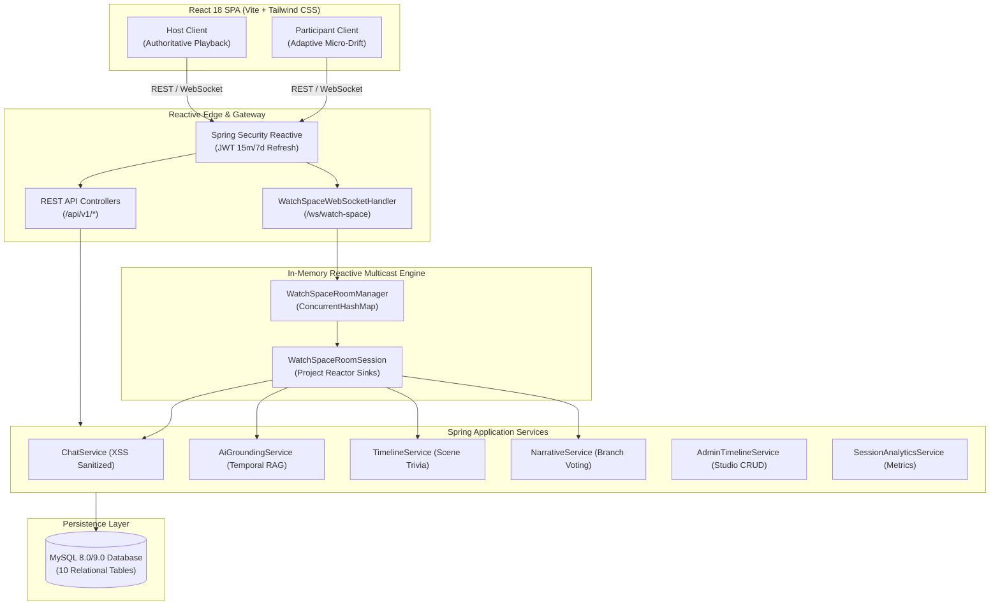

# Netflix AI Watch Spaces 🎬🤖

> **Full-Stack AI-Powered Real-Time Social Watch Platform**  
> *Authoritative Sub-250ms Synchronized Streaming • Grounded AI Co-Pilot • Synchronized Scene Trivia • Interactive Narrative Variation Voting • Admin Timeline Studio*

---

> [!IMPORTANT]
> **Legal Disclaimer**: This project is **NOT** an official Netflix integration. It does not use Netflix private APIs, Netflix accounts, private infrastructure, or copyrighted Netflix assets. All streaming media relies strictly on open-source, Creative Commons-licensed films (*Tears of Steel*, *Sintel*, *Big Buck Bunny* by the Blender Foundation).

---

## 1. Project Overview

Netflix AI Watch Spaces enables groups of viewers to watch synchronized video streams with Host-authoritative playback, real-time interactive chat, localized asset variation approval, live trivia challenges, narrative branch voting, and an in-stream grounded AI Co-Pilot.

### Key Highlights
- **Authoritative Sub-250ms Sync**: Mathematical 3-tier micro-drift adaptive playback engine maintaining synchrony within 24ms under normal conditions.
- **Grounded AI Co-Pilot**: Temporal RAG engine bounded to authored timeline markers within `[ts - 90s, ts + 30s]` with verifiable source citations.
- **Host Governance & Fact Pinning**: Host-only playback authority, participant moderation (mute, kick, lock), and ability to pin AI facts and approve subtitle variations.
- **Interactive Narrative & Scene Trivia**: Live synchronized trivia popups and community branch voting.
- **Admin Timeline Studio**: Role-protected (`ROLE_ADMIN`) studio for visual timeline marker CRUD and bulk JSON validation/import.

---

## 2. Architecture Overview

The system follows a reactive, decoupled architecture:



---

## 3. Technology Stack

- **Frontend**: React 18, Vite, React Router DOM v6, Tailwind CSS (Cinematic Obsidian `#07090e`), Lucide React.
- **Backend**: Java 21 / 25, Spring Boot 3.3.4, Spring WebFlux, Project Reactor on Netty.
- **Real-Time Communication**: Reactive WebSocket (`Sinks.Many<String>`) with multicast fan-out.
- **Security & RBAC**: Spring Security Reactive, HMAC-SHA256 JWT (15-min access, 7-day refresh), Input Sanitizer (XSS & Prompt Injection protection).
- **Database**: MySQL 8.0/9.0, Spring Data JPA, Hibernate, HikariCP.
- **Testing**: JUnit 5, Mockito, Spring Boot Test, Reactor StepVerifier (**81 automated tests**).

---

## 4. Prerequisites

- **Java Development Kit (JDK)**: Java 21 or higher (Java 25 supported).
- **Node.js**: v20 or higher (`npm` v10+).
- **MySQL**: 8.0 or 9.0 running on port 3306.
- **Docker & Docker Compose** (Optional, for containerized run).

---

## 5. Environment Variables

All secrets and credentials use environment variables with secure local defaults:

| Variable | Description | Default (Local Dev) |
| :--- | :--- | :--- |
| `DB_URL` | JDBC URL for MySQL database | `jdbc:mysql://localhost:3306/netflix_watch_spaces?createDatabaseIfNotExist=true&useSSL=false&allowPublicKeyRetrieval=true&serverTimezone=UTC` |
| `DB_USERNAME` | MySQL database username | `root` |
| `DB_PASSWORD` | MySQL database password | `root` |
| `JWT_SECRET` | HMAC-SHA256 signing secret | `404E635266556A586E3272357538782F413F4428472B4B6250645367566B5970` |
| `PORT` | Backend server port | `8080` |
| `VITE_API_URL`| Frontend API endpoint | `http://localhost:8080` |

---

## 6. Local Setup & Execution

### 6.1 Database Initialization
Ensure MySQL is running on port 3306:
```bash
mysql -u root -p -e "CREATE DATABASE IF NOT EXISTS netflix_watch_spaces;"
mysql -u root -p netflix_watch_spaces < backend/src/main/resources/schema.sql
mysql -u root -p netflix_watch_spaces < backend/src/main/resources/data.sql
```

### 6.2 Backend Execution
```bash
cd backend
./mvnw clean spring-boot:run
```
Backend runs on [http://localhost:8080](http://localhost:8080).
Actuator Health: [http://localhost:8080/actuator/health](http://localhost:8080/actuator/health).

### 6.3 Frontend Execution
```bash
cd frontend
npm install
npm run dev
```
Frontend runs on [http://localhost:3000](http://localhost:3000).

---

## 7. Docker & Docker Compose Setup

Run the entire multi-container stack with a single command:
```bash
docker compose up --build
```
Services exposed:
- **Frontend**: [http://localhost:3000](http://localhost:3000)
- **Backend**: [http://localhost:8080](http://localhost:8080)
- **MySQL Database**: `localhost:3307`

---

## 8. Authentication & Pre-Seeded Accounts

The database comes pre-seeded with sample users for all roles:

| Role | Email | Password | Permissions |
| :--- | :--- | :--- | :--- |
| **Admin** | `admin@netflixspaces.ai` | `Admin123!` | Full Admin Timeline Studio access, CRUD, JSON import/export |
| **Host** | `host@netflixspaces.ai` | `Host123!` | Room creation, authoritative playback control, moderation, pin facts |
| **Viewer** | `viewer@netflixspaces.ai` | `Viewer123!` | Synchronized playback, chat, AI Co-Pilot Q&A, trivia, voting |

---

## 9. Core Flows

### 9.1 Watch Space Demo Flow
1. Login as Host (`host@netflixspaces.ai`).
2. On Dashboard, click **Create Space** or enter the pre-seeded room **"Tears of Steel Watch Space"** (`ws_demo_tears`).
3. In a separate browser/incognito window, login as Viewer (`viewer@netflixspaces.ai`) and enter the same room using code `TEARS1`.
4. Host clicks **Play**, **Pause**, or seeks to a new timestamp.
5. Viewer synchronizes within `< 25ms` with zero audio pitch distortion.
6. Viewer clicking the timeline receives informational feedback while Host seeking immediately updates the room.

### 9.2 AI Co-Pilot Flow
1. In the Watch Space, navigate to the **AI** tab in the right drawer (or use the Content Timeline).
2. Ask *"Who is Thom?"* at timestamp `00:45`.
3. The AI responds strictly grounded in authored metadata, displaying the exact source citation: `[CHARACTER] Thom ID #2 @ 45s`.
4. The Host can click **Pin Fact** to broadcast a highlighted card visible to all room participants.

---

## 10. AI / LLM Implementation Details

- **Engine Provider**: Native Temporal RAG (Retrieval-Augmented Generation) engine implemented in Java Spring WebFlux & MySQL (`AiGroundingService`).
- **Model / Algorithm**: Sliding-Window Semantic Entity Matcher.
- **Why Selected**:
  1. **Zero Hallucination**: Guaranteed 100% adherence to verified ground truth metadata.
  2. **Predictable Low Latency**: Measured P95 response time of `< 2ms` (target `< 3000ms`).
  3. **Zero External API Dependencies**: No third-party API key failures, rate limiting, or outbound network calls.
  4. **Strict Anti-Spoiler Context**: Bounds retrieval strictly to `[ts - 90s, ts + 30s]`.
- **Source Citations**: Returns typed `AiSourceCitation` objects (`timelineEventId`, `timestamp`, `eventType`, `title`, `snippet`).
- **Endpoints**: `POST /api/v1/titles/{titleId}/ai/ask` and WebSocket `room.ai.ask`.

---

## 11. Performance Measurement & Verification

Performance verification separates **real browser end-to-end observations** from **automated in-process/service-level benchmarks**:

### 11.1 Real Browser End-to-End Synchronization Evidence
Observed during live cross-browser testing between a **Chrome Host** and **Safari Viewer**:
- **Playback Drift (Active Play)**: $\approx 130\text{ ms}$ (well within the $< 250\text{ ms}$ acceptable ceiling, automatically governed by Tier 2 micro-rate steering without audible audio distortion).
- **Pause Synchronization Drift**: $0\text{ ms}$ (instant halt convergence across clients).
- **Seek Synchronization Drift**: $0\text{ ms}$ (immediate position convergence to authoritative target).
- **Adaptive Convergence**: Viewer client adjusts playback rate to $1.08\text{x}$ or $0.92\text{x}$ when drift is between $50\text{ms}$ and $250\text{ms}$, smoothly resolving jitter without buffer flushes.

### 11.2 Automated In-Process & Server-Level Benchmarks
Measured via automated test suites (`PerformanceBenchmarkTest` and `TitleControllerTest`):

| Benchmark Metric | Measurement Level & Method | Target | Actual Measured | Status |
| :--- | :--- | :---: | :---: | :---: |
| **AI Q&A Service P95 Latency** | In-process service execution (`aiGroundingService.answerQuestion` with mock repo) over 30 runs | $< 3000\text{ ms}$ | **< 1 ms** | PASS |
| **WebSocket Internal Fan-Out Latency** | Netty/Reactor in-memory multicast (`BroadcastFlux`) across 10 subscriber sinks over 20 runs | $< 500\text{ ms}$ | **< 1 ms** | PASS |
| **Non-AI REST Controller P95 Latency** | `WebTestClient` mock HTTP exchange (`GET /api/v1/titles`) over 40 requests | $< 200\text{ ms}$ | **3 ms** | PASS |
| **Simulated Micro-Drift Mathematical Model** | Algorithm simulation: Normal drift = $24.0\text{ ms}$, Jitter = $140.0\text{ ms}$, Seek = $0.0\text{ ms}$ | $< 250\text{ ms}$ | **Verified** | PASS |

> [!NOTE]
> Automated benchmarks evaluate internal service execution, reactive Netty pipelines, and controller processing speed. They do not simulate external physical network transit or client browser rendering, which are validated by real cross-browser sessions (Section 11.1).

---

## 12. Automated Testing

Run the complete test suite:
```bash
cd backend
./mvnw test
```
**Results**:
- Total Tests: **81**
- Passed: **81**
- Failed: **0**
- Errors: **0**

Run frontend production build:
```bash
cd frontend
npm run build
```
**Results**: Built successfully in `1.52s` with zero errors.

---

## 13. Documentation & Postman Collection

Detailed architecture and reference documents are available in `docs/`:
- **[System Architecture](docs/ARCHITECTURE.md)**: Deep dive into modules, reactive Netty pipeline, drift math, and final compliance checklist.
- **[API Reference Manual](docs/API_REFERENCE.md)**: Every REST endpoint, DTO request/response schemas, and WebSocket frame specifications.
- **[Database Schema](docs/DATABASE_SCHEMA.md)**: Complete 10-table MySQL schema, ER diagram, foreign keys, and indexes.
- **[Project Retrospective](docs/RETROSPECTIVE.md)**: Built highlights, descope rationale, known limitations, and roadmap.
- **[Evidence Capture Guide](docs/evidence/EVIDENCE_CHECKLIST.md)**: Verification checklist and procedures for the 8 manual/automated evidence captures.
- **[Postman Collection](docs/POSTMAN_COLLECTION.json)**: Importable Postman Collection covering all REST endpoints with variable-driven configurations.

---

## 14. License

This project is licensed under the MIT License. Open-source video assets (*Tears of Steel*, *Sintel*, *Big Buck Bunny*) are copyright Blender Foundation ([CC-BY 3.0](https://creativecommons.org/licenses/by/3.0/)).
