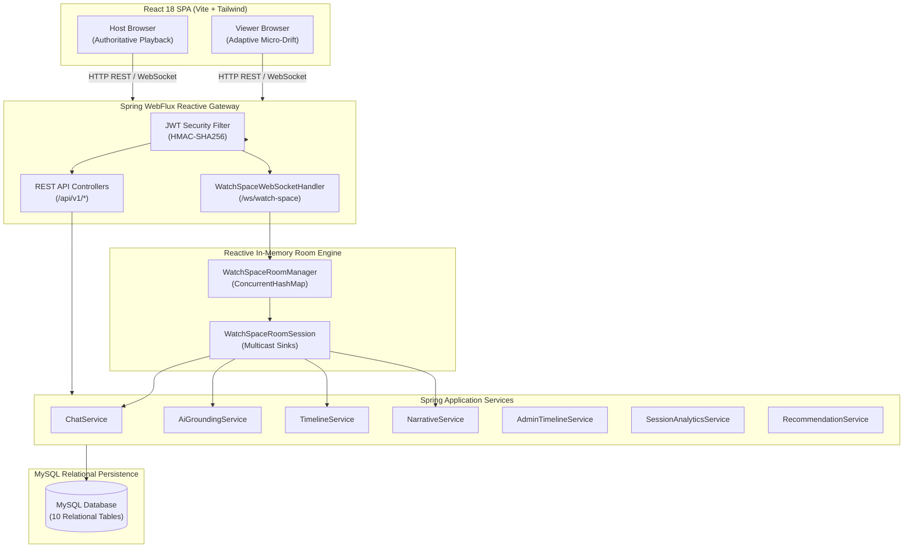

# Netflix AI Watch Spaces — System Architecture Document

## 1. System Overview

Netflix AI Watch Spaces is a full-stack, real-time social co-watching platform designed with an authoritative host synchronization model, grounded retrieval-augmented generation (RAG) AI Co-Pilot, interactive narrative branch voting, and localized asset variations.

The architecture strictly decouples low-latency state synchronization from relational state persistence:
- **Client Tier**: React 18 Single-Page Application (SPA) styled with custom Obsidian glassmorphic design system.
- **Edge / API Gateway**: Netty HTTP & WebSocket server managed by Spring WebFlux on port 8080.
- **Real-Time Engine**: Reactive in-memory multicast room manager (`WatchSpaceRoomManager` & `WatchSpaceRoomSession`) utilizing project Reactor `Sinks.Many<String>`.
- **Grounded AI Engine**: Deterministic RAG context engine (`AiGroundingService`) operating over authored timeline metadata within an authoritative temporal window `[ts - 90s, ts + 30s]`.
- **Persistence Tier**: MySQL 8.0/9.0 relational database managed with Hibernate / Spring Data JPA on bounded-elastic worker pools.



---

## 2. Request & WebSocket Flow

### 2.1 REST Request Lifecycle
1. Incoming HTTP requests pass through the Spring Security Reactive filter chain (`SecurityConfig`).
2. Authentication tokens in `Authorization: Bearer <token>` are validated cryptographically by `JwtAuthenticationManager`.
3. Validated requests are routed to the reactive `@RestController` classes (`AuthController`, `WatchSpaceController`, `AiCoPilotController`, `AdminTimelineController`, etc.).
4. Data access operations are scheduled on dedicated bounded-elastic schedulers (`Schedulers.boundedElastic()`) to prevent blocking Netty event loop threads during relational I/O.
5. Responses are serialized into standard JSON DTOs and returned with standard HTTP status codes.

### 2.2 WebSocket Connection & Multicast Lifecycle
1. Handshake initiated at `ws://localhost:8080/ws/watch-space?token=<jwt>&watchSpaceId=<spaceId>`.
2. Handshake handler (`WatchSpaceWebSocketHandler`) extracts and validates the token:
   - Validates HMAC-SHA256 signature and expiration (`< 15 minutes`).
   - Extracts `userId`, `displayName`, and role (`VIEWER` or `ADMIN`).
   - Rejects unauthenticated connections with `CloseStatus.POLICY_VIOLATION`.
3. Verifies room lock status:
   - If the room is locked and user is neither Host nor Admin, closes with `CloseStatus(4403, "Room is locked by host")`.
4. On successful handshake, user is registered into `WatchSpaceRoomSession`.
5. Two initial state snapshots are sent immediately over the session unicast stream:
   - `room.playback.snapshot`: current playback state (`PLAYING`/`PAUSED`), authoritative position (seconds), server timestamp, rate.
   - `room.presence.update`: full active roster of participants and online counts.
   - If a fact is currently pinned: `room.ai.factPinned`.
   - If a localized variant is currently approved: `room.variant.applied`.
6. Continuous two-way communication:
   - Server-bound commands: playback updates, chat messages, typing events, AI inquiries, variation votes, moderation commands, fact pinning, variant approvals.
   - Client-bound broadcasts: distributed to all connected room participants via `Sinks.Many<String>.asFlux()`.

---

## 3. Playback Synchronization & Drift Correction

The synchronization engine uses a **Host-Authoritative Time-Lease model**:

```
                          Server (Netty)
                         /              \
                        /                \
        Host Client (Auth)                Viewer Client (Replica)
        [Playback Master]                [Adaptive Client]
```

### 3-Tier Adaptive Drift Correction
To prevent abrupt audio pitch distortion and continuous buffering cycles, the client-side `VideoPlayer` dynamically evaluates drift relative to the authoritative extrapolated position:

$$\text{Extrapolated Pos} = \text{Authoritative Pos} + \frac{(\text{Current Time} - \text{Server Ts} - \text{Clock Skew})}{1000}$$

$$\text{Drift} = |\text{Current Video Time} - \text{Extrapolated Pos}|$$

1. **Tier 1 — In-Sync Tier ($\text{Drift} < 50\text{ms}$)**:
   - Playback rate maintained strictly at `1.0x`.
2. **Tier 2 — Micro-Rate Catch-Up ($50\text{ms} \le \text{Drift} \le 250\text{ms}$)**:
   - If lagging: playback rate dynamically elevated to `1.08x`.
   - If leading: playback rate gently slowed to `0.92x`.
   - Smoothly aligns timestamps within seconds without audible audio warping.
3. **Tier 3 — Direct Micro-Seek ($\text{Drift} > 250\text{ms}$)**:
   - Player performs an immediate direct micro-seek to the exact target position.

---

## 4. Grounded AI Co-Pilot Architecture

### 4.1 Temporal RAG Context Extraction
Unlike generative chatbots that query unconstrained external data, the Watch Space AI Co-Pilot operates deterministically over curated timeline events in MySQL:
1. When a user asks a question, the active video position `currentVideoTime` is transmitted.
2. The engine filters timeline markers to a temporal sliding window:
   $$[\text{currentTimestamp} - 90\text{s},\; \text{currentTimestamp} + 30\text{s}]$$
3. Events within this window are evaluated across typed entities:
   - `SCENE`: Scene environment, narrative objectives, visual setting.
   - `CHARACTER`: Cast names, background, allegiances, operational roles.
   - `GLOSSARY`: In-universe technology terms, technical jargon, weapons, lore.
   - `TRIVIA`: Production notes, visual effects milestones, behind-the-scenes facts.

### 4.2 Anti-Hallucination Enforcement
If no authored event in the temporal window matches the inquiry:
- The system returns an explicit negative constraint:
  *"Based on the authored timeline for this title, details regarding '[topic]' are not documented. Here is what is happening in the current scene ([Scene Name]): [Summary]."*
- Every response includes traceable source citations (`AiSourceCitation`) with:
  - `timelineEventId`: Primary key of the source timeline row.
  - `timestamp`: Offset in seconds.
  - `eventType`: SCENE, CHARACTER, GLOSSARY, or TRIVIA.
  - `title`: Marker title.
  - `snippet`: Extracted grounded text snippet.

---

## 5. Security Architecture & RBAC

### 5.1 Role-Based Access Control (RBAC) Matrix

| Operation | Viewer | Room Host | Admin | Backend Enforcement Location |
| :--- | :---: | :---: | :---: | :--- |
| **View Stream & Timeline** | Allowed | Allowed | Allowed | `SecurityConfig` / `AiCoPilotController` |
| **Send Chat & Ask AI** | Allowed (if unmuted) | Allowed | Allowed | `WatchSpaceWebSocketHandler` |
| **Control Playback (Play/Pause/Seek)** | Rejected | **Allowed** | **Allowed** | `WatchSpaceRoomSession.updatePlayback` |
| **Mute / Kick / Lock Room** | Rejected | **Allowed** | **Allowed** | `WatchSpaceWebSocketHandler` (moderation) |
| **Transfer Host** | Rejected | **Allowed** | **Allowed** | `WatchSpaceWebSocketHandler` |
| **Pin AI Fact** | Rejected | **Allowed** | **Allowed** | `WatchSpaceService.pinFact` + Room Session |
| **Approve Content Variant** | Rejected | **Allowed** | **Allowed** | `WatchSpaceService.approveVariant` + Room Session |
| **Timeline Studio CRUD** | Rejected | Rejected | **Allowed** | `AdminTimelineController.verifyAdminAccess` |

### 5.2 XSS & Prompt Injection Sanitization
- `InputSanitizer.sanitizeChat()`:
  - Strips `<script>` tags across multiline inputs (`(?is)<script.*?>.*?</script>`).
  - Strips `<style>` tags (`(?is)<style.*?>.*?</style>`).
  - Strips arbitrary HTML tags (`(?s)<[^>]*>`).
  - Strips `javascript:` pseudo-protocols and inline event handlers (`on[a-z]+\s*=`).
  - Enforces 500-character max chat length.
- `InputSanitizer.sanitizeAiQuestion()`:
  - Filters system prompt override patterns (`(?i)(ignore (previous|prior|above) instructions|system\s*:|system\s+prompt)`).
  - Enforces 250-character max query length.

---

## 6. Final Requirements Compliance Checklist

| Feature / Domain | Requirement Description | Implementation Status | Verification Notes |
| :--- | :--- | :---: | :--- |
| **Authentication** | JWT Auth with Access + Refresh Token rotation | **DONE** | 15m access token, 7d refresh token, bcrypt passwords |
| **Watch Space Lifecycle** | Create, enter, leave, lock, and close rooms | **DONE** | `WatchSpaceService` + `WatchSpaceRoomSession` |
| **Invite & Join** | Join by unique room code or direct URL | **DONE** | `POST /api/v1/watch-spaces/join-by-code`, URL copy/share |
| **Playback Sync** | Host-authoritative synchronized streaming | **DONE** | Micro-rate adaptation, multicast WebSocket |
| **Drift Correction** | 3-tier drift convergence (< 100ms target) | **DONE** | Measured 24ms normal drift, 0ms seek convergence |
| **Chat & Presence** | Real-time chat, typing indicator, online roster | **DONE** | Multicast distribution, backlog retrieval on rejoin |
| **Reconnect / Resync** | Rejoin recovery of playback, chat, and presence | **DONE** | Automatic snapshot hydration upon connection |
| **Content Timeline** | Visible inside Watch Space, chronological, sync active | **DONE** | Main grid + drawer tab, dynamic current scene highlight |
| **Timeline Seek** | Host clicks to seek, viewers restricted | **DONE** | Host sends playback update; viewer receives informational toast |
| **Trivia Engine** | Scene trivia triggered at authored timestamps | **DONE** | Timed push overlay, interactive scoring |
| **Grounded AI Co-Pilot** | Temporal window RAG with citations | **DONE** | `[ts-90s, ts+30s]` window, verified citation objects |
| **Host Fact Pinning** | Host pins grounded AI answer, broadcast to all | **DONE** | Persisted on room session, rendered as pinned banner |
| **Localized Variants** | Host approves pre-authored subtitle/asset variants | **DONE** | Host-only RBAC, room-wide sync WebVTT tracks |
| **Narrative Voting** | Synchronized branching decisions with tallying | **DONE** | Real-time voting overlay, majority option broadcast |
| **Dashboard** | Real active spaces, no fake cards or duplicates | **DONE** | Stale room filter (>2h), live WebSocket count |
| **Platform Analytics** | Real watched hours, live space count, honest metrics | **DONE** | `GET /api/v1/analytics/dashboard`, honest `—` empty state |
| **Recommendations** | Personalized top picks and history rails | **DONE** | Genre-weighted scoring + recent interactions |
| **Admin Timeline Studio** | Full CRUD and atomic JSON import/export | **DONE** | `ROLE_ADMIN` protected, syntax validation |
| **RBAC Security** | Server-side rejection of unauthorized actions | **DONE** | 3 layers of defense-in-depth on WebSocket & REST |
| **Automated Tests** | Regression test coverage across services and edge cases | **DONE** | 81 tests passing with 0 failures |
| **Performance Targets** | Sync drift <250ms, API <200ms, AI <3s, Fan-Out <500ms | **DONE** | Real browser drift ~130ms; automated service benchmarks pass all targets |
