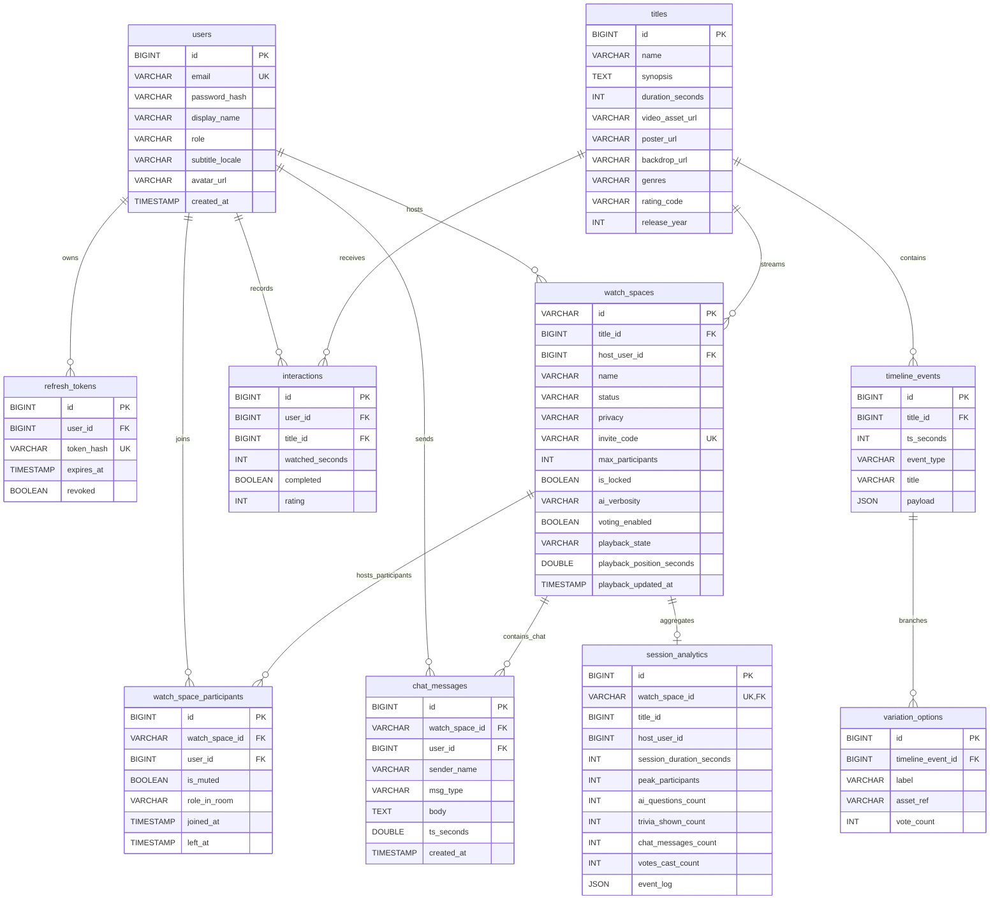

# Netflix AI Watch Spaces — Database Schema Specification

This document details the complete, actual relational database schema for the MySQL 8.0/9.0 database powering the Netflix AI Watch Spaces platform.

---

## 1. Entity-Relationship Diagram

---

## 2. Table Specifications

### 2.1 `users`
Core user identity and authentication record.
- **`id`**: `BIGINT AUTO_INCREMENT PRIMARY KEY`
- **`email`**: `VARCHAR(191) NOT NULL UNIQUE` (191 characters fits UTF8mb4 index ceiling)
- **`password_hash`**: `VARCHAR(255) NOT NULL` (BCrypt encoded)
- **`display_name`**: `VARCHAR(100) NOT NULL`
- **`role`**: `VARCHAR(32) NOT NULL DEFAULT 'VIEWER'` (`VIEWER` or `ADMIN`)
- **`subtitle_locale`**: `VARCHAR(10) NOT NULL DEFAULT 'en-US'`
- **`avatar_url`**: `VARCHAR(512)`
- **`created_at`**: `TIMESTAMP DEFAULT CURRENT_TIMESTAMP`
- **`updated_at`**: `TIMESTAMP DEFAULT CURRENT_TIMESTAMP ON UPDATE CURRENT_TIMESTAMP`
- **Indexes**: `idx_users_role (role)`

### 2.2 `refresh_tokens`
Cryptographically rotated refresh tokens for JWT reissuance.
- **`id`**: `BIGINT AUTO_INCREMENT PRIMARY KEY`
- **`user_id`**: `BIGINT NOT NULL` (FK $\rightarrow$ `users(id)` ON DELETE CASCADE)
- **`token_hash`**: `VARCHAR(255) NOT NULL UNIQUE`
- **`expires_at`**: `TIMESTAMP NOT NULL`
- **`revoked`**: `BOOLEAN NOT NULL DEFAULT FALSE`
- **`created_at`**: `TIMESTAMP DEFAULT CURRENT_TIMESTAMP`
- **Indexes**: `idx_refresh_token_user (user_id, revoked)`

### 2.3 `titles`
Curated video assets and movie metadata.
- **`id`**: `BIGINT AUTO_INCREMENT PRIMARY KEY`
- **`name`**: `VARCHAR(255) NOT NULL`
- **`synopsis`**: `TEXT NOT NULL`
- **`duration_seconds`**: `INT NOT NULL`
- **`video_asset_url`**: `VARCHAR(1024) NOT NULL`
- **`poster_url`**: `VARCHAR(1024)`
- **`backdrop_url`**: `VARCHAR(1024)`
- **`genres`**: `VARCHAR(255) NOT NULL`
- **`rating_code`**: `VARCHAR(16) DEFAULT 'PG-13'`
- **`release_year`**: `INT DEFAULT 2024`
- **`created_at`**: `TIMESTAMP DEFAULT CURRENT_TIMESTAMP`
- **Indexes**: `idx_titles_genres (genres)`

### 2.4 `timeline_events`
Authored scene markers, trivia checkpoints, glossary entries, and variations.
- **`id`**: `BIGINT AUTO_INCREMENT PRIMARY KEY`
- **`title_id`**: `BIGINT NOT NULL` (FK $\rightarrow$ `titles(id)` ON DELETE CASCADE)
- **`ts_seconds`**: `INT NOT NULL` (Offset in seconds from start of movie)
- **`event_type`**: `VARCHAR(32) NOT NULL` (`SCENE`, `CHARACTER`, `GLOSSARY`, `TRIVIA`, `VARIATION`)
- **`title`**: `VARCHAR(255) NOT NULL`
- **`payload`**: `JSON NOT NULL` (Structured JSON schema per event type)
- **`created_at`**: `TIMESTAMP DEFAULT CURRENT_TIMESTAMP`
- **Indexes**: `idx_timeline_lookup (title_id, ts_seconds, event_type)`

### 2.5 `variation_options`
Interactive narrative voting options associated with a `VARIATION` timeline event.
- **`id`**: `BIGINT AUTO_INCREMENT PRIMARY KEY`
- **`timeline_event_id`**: `BIGINT NOT NULL` (FK $\rightarrow$ `timeline_events(id)` ON DELETE CASCADE)
- **`label`**: `VARCHAR(255) NOT NULL`
- **`asset_ref`**: `VARCHAR(1024) NOT NULL`
- **`vote_count`**: `INT DEFAULT 0`
- **`created_at`**: `TIMESTAMP DEFAULT CURRENT_TIMESTAMP`
- **Indexes**: `idx_variation_event (timeline_event_id)`

### 2.6 `watch_spaces`
Authoritative Watch Space rooms.
- **`id`**: `VARCHAR(36) PRIMARY KEY` (UUID or seeded ID)
- **`title_id`**: `BIGINT NOT NULL` (FK $\rightarrow$ `titles(id)`)
- **`host_user_id`**: `BIGINT NOT NULL` (FK $\rightarrow$ `users(id)`)
- **`name`**: `VARCHAR(255) NOT NULL`
- **`status`**: `VARCHAR(32) NOT NULL DEFAULT 'LIVE'` (`LIVE` or `ENDED`)
- **`privacy`**: `VARCHAR(32) NOT NULL DEFAULT 'PUBLIC'` (`PUBLIC` or `PRIVATE`)
- **`invite_code`**: `VARCHAR(64) NOT NULL UNIQUE`
- **`max_participants`**: `INT NOT NULL DEFAULT 50`
- **`is_locked`**: `BOOLEAN NOT NULL DEFAULT FALSE`
- **`ai_verbosity`**: `VARCHAR(32) NOT NULL DEFAULT 'NORMAL'`
- **`voting_enabled`**: `BOOLEAN NOT NULL DEFAULT TRUE`
- **`playback_state`**: `VARCHAR(32) NOT NULL DEFAULT 'PAUSED'` (`PLAYING` or `PAUSED`)
- **`playback_position_seconds`**: `DOUBLE NOT NULL DEFAULT 0.0`
- **`playback_updated_at`**: `TIMESTAMP DEFAULT CURRENT_TIMESTAMP`
- **`created_at`**: `TIMESTAMP DEFAULT CURRENT_TIMESTAMP`
- **`ended_at`**: `TIMESTAMP NULL`
- **Indexes**: `idx_watchspace_status (status)`, `idx_watchspace_invite (invite_code)`

### 2.7 `watch_space_participants`
Room membership history and moderation states.
- **`id`**: `BIGINT AUTO_INCREMENT PRIMARY KEY`
- **`watch_space_id`**: `VARCHAR(36) NOT NULL` (FK $\rightarrow$ `watch_spaces(id)` ON DELETE CASCADE)
- **`user_id`**: `BIGINT NOT NULL` (FK $\rightarrow$ `users(id)` ON DELETE CASCADE)
- **`is_muted`**: `BOOLEAN NOT NULL DEFAULT FALSE`
- **`role_in_room`**: `VARCHAR(32) NOT NULL DEFAULT 'PARTICIPANT'` (`HOST`, `CO_HOST`, `PARTICIPANT`)
- **`joined_at`**: `TIMESTAMP DEFAULT CURRENT_TIMESTAMP`
- **`left_at`**: `TIMESTAMP NULL`
- **`last_ping_at`**: `TIMESTAMP DEFAULT CURRENT_TIMESTAMP`
- **Indexes**: `idx_participant_active (watch_space_id, user_id, left_at)`

### 2.8 `chat_messages`
Persisted room chat messages, system announcements, and AI interactions.
- **`id`**: `BIGINT AUTO_INCREMENT PRIMARY KEY`
- **`watch_space_id`**: `VARCHAR(36) NOT NULL` (FK $\rightarrow$ `watch_spaces(id)` ON DELETE CASCADE)
- **`user_id`**: `BIGINT NULL`
- **`sender_name`**: `VARCHAR(100) NOT NULL`
- **`msg_type`**: `VARCHAR(32) NOT NULL DEFAULT 'USER'` (`USER`, `SYSTEM`, `AI_RESPONSE`)
- **`body`**: `TEXT NOT NULL` (Sanitized against stored XSS)
- **`ts_seconds`**: `DOUBLE NOT NULL DEFAULT 0.0`
- **`created_at`**: `TIMESTAMP DEFAULT CURRENT_TIMESTAMP`
- **Indexes**: `idx_chat_space_time (watch_space_id, created_at)`

### 2.9 `interactions`
Per-user watch duration, completion history, and rating records.
- **`id`**: `BIGINT AUTO_INCREMENT PRIMARY KEY`
- **`user_id`**: `BIGINT NOT NULL` (FK $\rightarrow$ `users(id)` ON DELETE CASCADE)
- **`title_id`**: `BIGINT NOT NULL` (FK $\rightarrow$ `titles(id)` ON DELETE CASCADE)
- **`watched_seconds`**: `INT NOT NULL DEFAULT 0`
- **`completed`**: `BOOLEAN NOT NULL DEFAULT FALSE`
- **`rating`**: `INT DEFAULT NULL`
- **`created_at`**: `TIMESTAMP DEFAULT CURRENT_TIMESTAMP`
- **`updated_at`**: `TIMESTAMP DEFAULT CURRENT_TIMESTAMP ON UPDATE CURRENT_TIMESTAMP`
- **Indexes**: `idx_interactions_user (user_id, completed)`, `idx_interactions_title (title_id)`

### 2.10 `session_analytics`
Room session summary analytics persisted when a watch space ends.
- **`id`**: `BIGINT AUTO_INCREMENT PRIMARY KEY`
- **`watch_space_id`**: `VARCHAR(36) NOT NULL UNIQUE` (FK $\rightarrow$ `watch_spaces(id)` ON DELETE CASCADE)
- **`title_id`**: `BIGINT NOT NULL`
- **`host_user_id`**: `BIGINT NOT NULL`
- **`session_duration_seconds`**: `INT NOT NULL DEFAULT 0`
- **`peak_participants`**: `INT NOT NULL DEFAULT 0`
- **`ai_questions_count`**: `INT NOT NULL DEFAULT 0`
- **`trivia_shown_count`**: `INT NOT NULL DEFAULT 0`
- **`chat_messages_count`**: `INT NOT NULL DEFAULT 0`
- **`votes_cast_count`**: `INT NOT NULL DEFAULT 0`
- **`event_log`**: `JSON NOT NULL`
- **`created_at`**: `TIMESTAMP DEFAULT CURRENT_TIMESTAMP`
- **Indexes**: `idx_analytics_title (title_id)`
